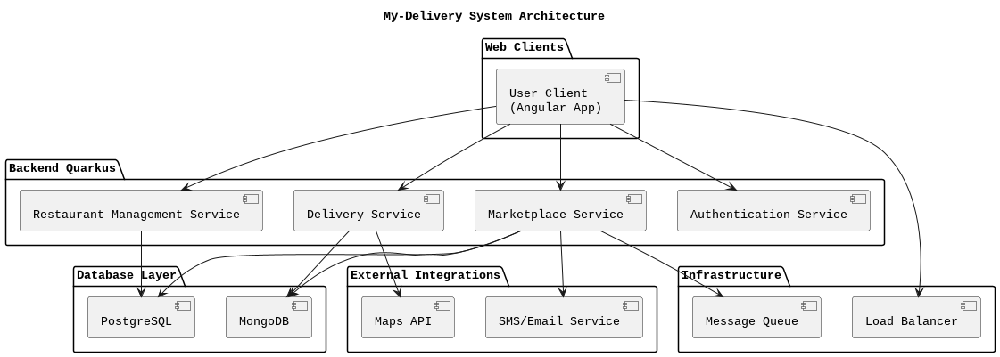

# SPEC-1: My-Delivery App (Demo Application for just Study Purposes)

## Background

The *My-Delivery* app is a demo app designed to be a general-purpose food delivery platform, similar to iFood. It will allow users to browse local restaurants, place orders, and track deliveries in real time. The platform will cater to a wide audience, connecting customers with a variety of cuisines. Both restaurants and delivery personnel will have dedicated interfaces to manage their services efficiently.

## Architecture Design

## Requirements

The requirements for *My-Delivery* are broken down according to the MoSCoW prioritization model:

### Must Have

1. **Restaurant Listings**
   - A searchable, filterable list of restaurants based on location, cuisine, and ratings.
   - Restaurant profiles including details such as menus, ratings, operating hours, and contact information.
  
2. **Menu Items Listings**
   - A searchable, filterable list of Menu Items based on category, restaurants.

3. **Restaurant Management (Admin Dashboard for Restaurants)**
   - Restaurants can register and create their profiles.
   - Restaurant owners can add, modify, or remove menu items, and set prices.
   - Update product availability and business hours in real-time.

4. **Menu and Order Management**
   - Customers can browse restaurant menus and add items to their carts.
   - Support for order customization (special instructions, portion sizes, etc.).

5. **Order Placement**
   - Comprehensive order summary showing price breakdown, delivery fees, and time estimates.
   - Payment manually on delivery.

### Should Have

1. **User Registration & Authentication**
   - Users can register and log in using email or social media accounts.
   - User profile management features (name, contact information, etc.).

2. **Push Notifications**
   - Real-time updates on order status and promotional offers.

3. **Promotions & Discounts**
   - Allow restaurants to offer discount codes, and users to apply promo codes during checkout.

4. **Customer Support Chat**
   - In-app support for customer queries and issues.

5. **Order History**
   - Users can view and reorder from their past orders.

6. **Real-time Order Tracking**
   - Track the order status (preparing, dispatched, delivered) with live delivery tracking via map integration.

7. **Ratings and Reviews**
   - Customers can review both the restaurant and the delivery personnel.
   - Display average ratings and reviews on restaurant profiles.

8. **Delivery Person Interface**
   - Dedicated app or interface for couriers to view and accept deliveries.
   - Navigation integration to assist delivery personnel in reaching destinations.
  
9. **Payment Service**
   - System of payment service for customers with multiple payment options including credit/debit cards and Digital wallet.
   - Integration for external payment services such as PayPal

### Could Have

1. **Loyalty Program**
   - Reward customers for repeat orders with points or discounts.

2. **Scheduled Orders**
   - Allow users to place an order for a future time or date.

### Won't Have (for MVP)

1. **Table Reservations**
   - Features allowing users to reserve tables at restaurants will not be included in the initial version.
